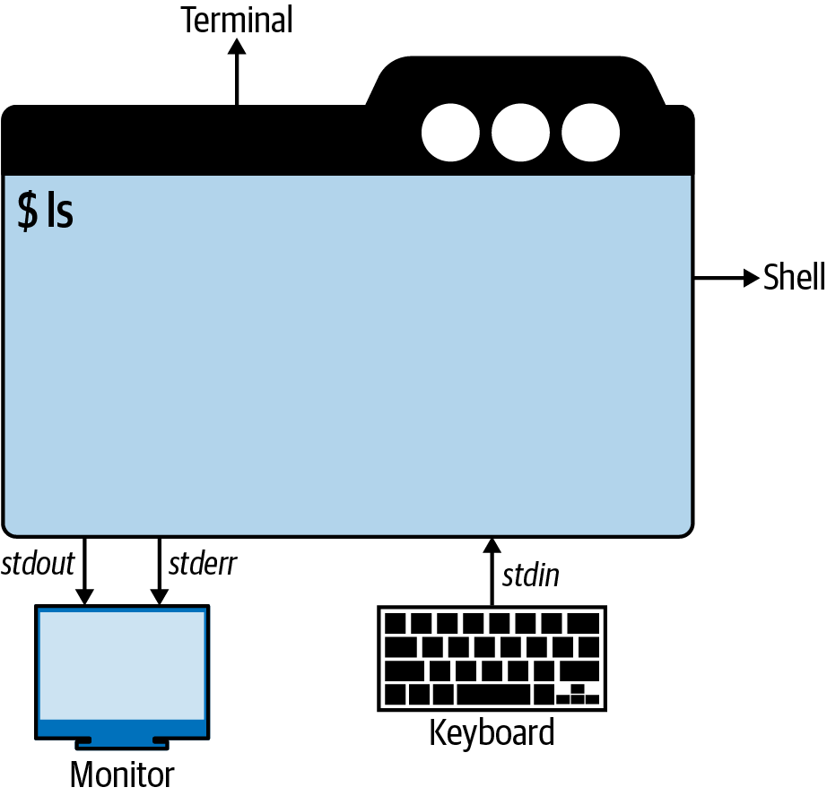
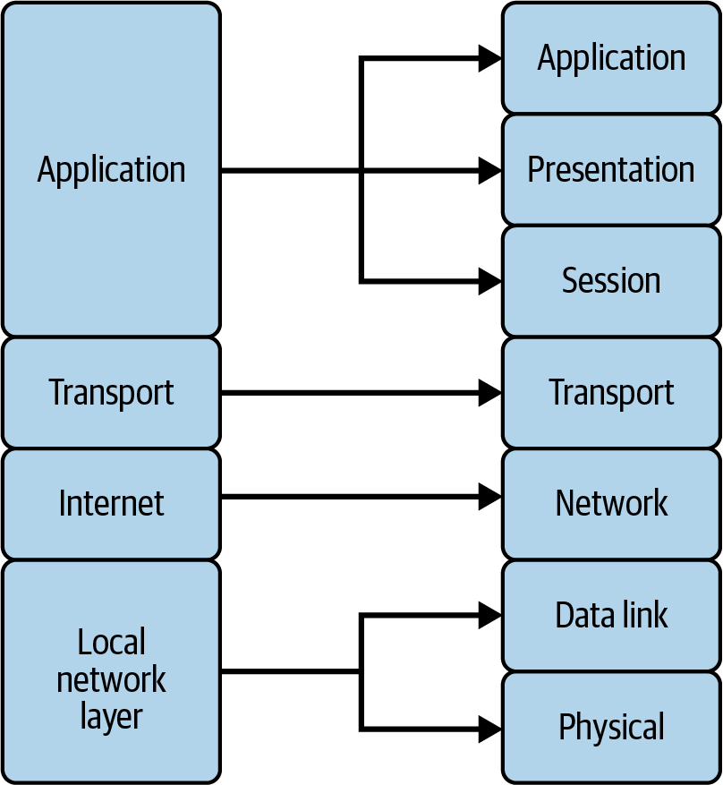
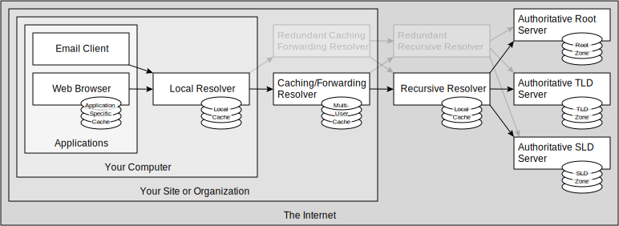

# Chap 2. Foundational Knowledge in 25 Pages or Less

## The Command-Line Interface

### Command Line - Terminal - Shell

terminal (terminal simulator)
: a program that provides a textual user interface
: - reads characters from the keyboard & displays them on the
screen
: - handle _escape code_ (aka _escape sequence_), e.g. `Ctrl + C`
: e.g.
: - OS's defaults: [MacOS Terminal], [GNOME Terminal], Command Prompt (Windows)
: - 3rd-party: [iTerm2], [Windows Terminal]
: - New generation that use GPU: **Alacritty**, **Kitty**, **Warp**

shell
: a program that run inside the terminal:
: - acts as a command interpreter
: - handles input/outputs (IO) via streams (`stdin`, `stdout`, `stderr`)
: - provides: variables (e.g. `$SHELL`), built-in commands (e.g. `ls`, `cd`)
: e.g.
: - **sh**: Bourne shell
: - **bash**: **B**ourne **a**gain **sh**ell
: - Modern, human-friendly shells: **zsh**, **fish**
: - Windows: `MS-DOS`, `PowerShell`

### Why Do I Need the Command Line?

- Speed (with enough practice)
- The CLI tools can do things GUI tool can't do.

### Getting Started with the Command Line

#### Shell's Streams

When performing I/O, a _system call_ refer to an **open file** using a _file descriptor_ - a (usually
small) nonnegative integer.

Open files are regular files or pipes, FIFOs, sockets, terminals, devices.

Each process has its own set of file descriptors:

- Including 3 standard file descriptions:

  | File descriptor | Purpose         | `stdio` stream |
  | --------------- | --------------- | -------------- |
  | `0`             | Standard Input  | `stdin`        |
  | `1`             | Standard Output | `stdout`       |
  | `2`             | Standard Error  | `stderr`       |

- These 3 standard file descriptor are opened on the process's behalf (by the shell), before the process is started.

  

> [!TIP]
> More precisely,
>
> - In a non-interactive shell, the program _inherits_ copies of the **shell**’s file descriptors.
>
>   The shell normally operates with these three file descriptors always open
>
> - In an interactive shell, these 3 file descriptors refer to the **terminal** under which the shell running.

## Protocols: A High-Level Overview

protocol (communication protocol)
: When multiple parties communicate, a protocol is an agreement on how each party will act

Computers are built around conformance to protocols to ensure interoperability.

The internet are built on common, shared & open protocols:

- Internet Protocol suite (TCP/IP)
- OSI model

### Protocol Layers

- TCP/IP protocol: 4 layers
- OSI model: 7 layers



When devices communicate over a network, the **data** is _passed down_ the layers

- from an application e.g. a web browser
- eventually onto a physical medium e.g. wired Ethernet or radio signals for WiFi.

The receiver then _passes the data up_ through the layers to the corresponding application on the receiving side.

> [!NOTE]
> Protocol Wars (Internet–OSI Standards War)
> Which communication protocol would result in the best and most robust networks?
>
> - Internet protocol suite (TCP/IP)
> - OSI model
>
> The winner is TCP/IP.
> (OSI model is still used as a reference for teaching, documentation, cloud computing)

### Two Protocols Plus Another

TCP (Transmission Control Protocol)
: connection-oriented
: applications receive packets in an orderly sequence

UDP (User Datagram Protocol)
: connection-less
: applications receive packets in an un-orderly sequence
: - ensuring that packets have arrived
: - asking for retransmission when packets have not arrived

ICMP (Internet Control Message Protocol)
: Used by `ping` command
: - The `ping` command sends `Echo Request,` (ICMP message type 8)
: - The device under test responds with `Echo Reply,` (ICMP message type 0)

### Basic Internet Protocols

#### DNS

##### Domain name system

DNS (domain name system)
: What? A naming system for computers, resources... in the Internet
: Analogy? Phone book of the internet
: - Name -> Phone Number
: - Domain Name (aka hostname) -> IP Address
: How? Delegates the responsibility of assigning domain names & mapping those names to Internet resources by designating authoritative name servers for each domain

The Internet maintains two principal **namespaces**:

- the **domain name _space_** (aka **domain name _hierarchy_**)
- the IP **address spaces** (IPv4, IPv6)

The Domain Name System

- maintains the domain name space
- provides translation services between the domain name space and the address spaces

> [!NOTE]
> DNS isn’t just any naming system: it’s the internet’s standard naming system as well as one of the largest _distributed databases_ in the world.[^1]

> [!IMPORTANT]
> DNS is also a _client–server_ system:
>
> - _DNS clients_ querying _DNS servers_ to retrieve data stored in that distributed database.
> - Because the database is distributed, DNS servers will often need to query one or more other DNS servers to find a given piece of data.
>
> DNS clients are often called _resolvers_, whereas DNS servers are sometimes called _name servers_.
>
> Resolvers ask DNS servers for information about particular indexes into the distributed database.[^1]

##### Domain name space, DNS zones

The **domain name space** consists of a **tree** data structure:

- Each **node** (or leaf) in the tree has a _label_ and zero or more _resource records_ (RR), which hold information associated with the **domain name**.

- The tree sub-divides into _zones_:

  - A DNS zone may consist of as many domains and subdomains as the zone manager chooses.

    - Administrative responsibility for any zone may be divided by creating additional zones.

      Authority over the new zone is said to be _delegated_ to a designated name server.
      The parent zone ceases to be **authoritative** for the new zone.

  - The tree begins at the _root zone_ (a single dot `.`)

  - The second level of zones:
    - Top-level domain (TLDs):
      - Generic TLDs (gTLDs): `com`, `org`, `net`, `edu`...
      - Country-code TLDs (ccTLDs): `us`, `uk`, `vn`...

DNS servers can load _zone data_ from:

- zone data file (aka master files)

> [!NOTE]
> A DNS server that loads information about a zone from a zone data file is called a _primary DNS server_ for that zone.

- other DNS servers via a mechanism called a _zone transfer_

> [!NOTE]
> A DNS server that loads information about a zone from another DNS server using zone transfer is said to be a _secondary DNS server_ for that zone.
>
> The DNS server from which the secondary DNS server transfers the zone is referred to as its _master DNS server_.
>
> Both the primary and secondary DNS servers for a zone are said to be authoritative for the zone.

> [!NOTE]
> DNS is a distributed database:
>
> - **indexes** (domain names)
> - **partitions** of the database (zones)

> [!TIP]
> DNS can also be partitioned according to _class_.
>
> - The only class we need to know is `IN` (Internet)

##### Domain name

The **domain name** itself consists of the **label**, concatenated with the label of its parent nodes on the right, separated by a dot (`.`).

- e.g. `example.com`

  - `example`: DNS node's label
  - `.`: separator
  - `com`: parent node's name

- The right-most label conveys the **top-level domain** (`TLD`)

  e.g. the domain name `example.com` belongs to the TLD `com`.

- The hierarchy of domains descends from _right to left_; each label to the left specifies a subdivision, or _subdomain_ of the domain to the right.

  e.g.

  - the label `example` is a subdomain of the `com` domain
  - the label `www` is a subdomain of `example.com` domain

##### DNS limitations

- The domain name space (hierarchy) may have up to 127 levels.
- A label may contain 63 characters.
- The full domain name may contain 253 characters (other 2 octets are for the length of the domain name)
- The character may be in a subset of ASCII character set - _LDH_ rule:
  - Letter: `a-z`, `A-Z` (The domain names are _case-insensitive_ interpreted)
  - Digit: `0-9`
  - Hyphen: `-`

> [!NOTE]
> Can a domain name contain Unicode characters?
>
> An application can use domain name that has Unicode characters via Internationalizing Domain Names in Applications (`IDNA`) system, in which:
>
> - The application (e.g. web browser) can map Unicode characters to valid DNS character set using `Punnycode`.

##### Domain registration

Each TLD is delegated to a `registrar` to managed that DNS zone.

Domain (within a TLD) is registered within the desired TLD, according to the rules ot the `registrar` (of that TLD).

When a domain name is registered, control of the sub-domain within that domain is delegated to the `registrant` (the person/organization who registered the domain with the register of that TLD)

- The `registrant` needs to provide at least 2 **_authoritative_ name server**, which response to DNS query for sub-domain of that domain name.

##### DNS Resource Records

> [!TIP]
> DNS is a distributed database:
>
> - **indexes** (domain names)
> - **partitions** of the database (zones)
>
> What is the data?

Data in DNS is stored in units of `resource records` (`RR`).

Resource records come in different `classes` and `types`.

- The `classes` were intended to allow DNS to function as the naming service for different kinds of networks.

  In practice DNS is used only on the internet and TCP/IP networks, so just one class, `IN` for internet, is used.

- The `types` of resource records in the IN class specify both the format and application of the data stored

  - Some of the most common resource record types in the `IN` class

    | RR Type | Description                    | Function                                                                   |
    | ------- | ------------------------------ | -------------------------------------------------------------------------- |
    | `A`     | IPv4 **A**ddress               | Maps a domain name to a single IPv4 address                                |
    | `AAAA`  | IPv6 **A**ddress               | Maps a domain name to a single IPv6 address                                |
    | `CNAME` | **C**anonical **Name** (Alias) | Maps a domain name (the alias) to another domain name (the canonical name) |
    | `MX`    | **M**ail E**x**changer         | Names a mail exchanger (mail server) for an email destination              |
    | `NS`    | **N**ame **S**erver            | Names a name server (or DNS server) for a zone                             |
    | `PTR`   | **P**oin**t**e**r**            | Maps an IP address back to a domain name                                   |
    | `SOA`   | **S**tart **o**f **A**uthority | Provides parameters for a zone                                             |

  - Overview of all active DNS record types

    

Resource Records are in `master file format` which including 5 fields `[NAME] [TTL] [CLASS] TYPE RDATA`.

| RR Field  | Function                                                                                                                            | Note                                                                                                                                                    | Example                                                                                                |
| --------- | ----------------------------------------------------------------------------------------------------------------------------------- | ------------------------------------------------------------------------------------------------------------------------------------------------------- | ------------------------------------------------------------------------------------------------------ |
| [`NAME`]  | [Optional] The domain name to which this resource record is attached                                                                | Can be:<br />- a **_fully qualified_ domain name** (`FQDN` - ended in a dot - `.`) <br />- or a **_relative_ domain name** (doesn't end in a dot)       | `@` (the origin - by default is the domain name of the zone)<br />`.` (the root)<br />`www` (relative) |
| [`TTL`]   | [Optional] The time-to-live (TTL) value for the resource record, which governs how long a recursive DNS server can cache the record | TTL can be specified by:<br />- a 32 bit integer number of seconds<br />- or use _scscaling factorsaling factors_, e.g. `s`, `h`, `d`, `w`, as a suffix | - `86400`<br />- `86400s`, `24h`, `1d`<br />- `1h30m`                                                  |
| [`CLASS`] | [Optional] Class field is almost always `IN` - default.                                                                             | There are also `CH`, `HS`                                                                                                                               |                                                                                                        |
| `TYPE`    | aka _type mnemonics_ - will be translated to a numeric type code                                                                    |                                                                                                                                                         |                                                                                                        |
| `RDATA`   | Data for that RR type                                                                                                               | For each RR type, `RDATA` stores record-specific data (in a particular format)                                                                          |                                                                                                        |

> [!IMPORTANT]
> Each resource record can only map a domain name to a single `RDATA` field.
>
> To map a domain name to multiple `RDATA` fields, you can create multiple resource records with the same `NAME` (aka a `resource record set`)
>
> e.g.
>
> - All zones has a `NS` RRSet with at least 2 `NS` RRs
>
>   ```
>   example.com.  72186 IN NS a.iana-servers.net.
>   example.com.  72186 IN NS b.iana-servers.net.
>   ```
>
>   ```
>   google.com.  6626 IN NS ns1.google.com.
>   google.com.  6626 IN NS ns3.google.com.
>   google.com.  6626 IN NS ns2.google.com.
>   google.com.  6626 IN NS ns4.google.com.
>   ```
>
> - `amazon.com` zone has a `A` RRSet with 3 `A` RRs
>
>   ```
>   amazon.com.  628 IN A 52.94.236.248
>   amazon.com.  628 IN A 54.239.28.85
>   amazon.com.  628 IN A 205.251.242.103
>   ```

#### Hostname resolution

##### Resolution

> [!TIP]
> In Vietnamese, _Domain Name System_ means **hệ thống _phân giải_ tên miền**. What is the extra _phân giải_?
> It's _resolution_.

For a host - with a valid IP address - to communicate on a network, the host needs to translate the friendly name (domain name) to an IP address.

- First, it examines a locally file called `hosts`

  e.g.

  - Linux/Mac: `/etc/hosts`

    ```
    ##
    # Host Database
    #
    # localhost is used to configure the loopback interface
    # when the system is booting.  Do not change this entry.
    ##
    127.0.0.1       localhost
    255.255.255.255 broadcasthost
    ::1             localhost
    ```

  - Windows: `%SystemRoot%\System32\Drivers\etc\hosts`

- If the destination computer is not defined in the `hosts` file, the DNS is queried next (by DNS resolvers).

##### DNS resolution (by DNS resolvers)

Domain name resolvers determine the domain name servers responsible for the domain name in question by a sequence of queries starting with the right-most (top-level) domain label.

- The resolution process starts with a query to one of the root servers.
- In typical operation, the root servers do not answer directly, but respond with a referral to more authoritative servers,

  e.g., a query for "www.wikipedia.org" is referred to the org servers.

- The resolver now queries the servers referred to, and iteratively repeats this process until it receives an authoritative answer.


The diagram illustrates this process for the host that is named by the fully qualified domain name "www.wikipedia.org".

> [!IMPORTANT]
> Each device that _receives_ an IP address _typically_ also _receives_ one or more DNS servers that act on behalf of those devices to obtain hostnames from other DNS servers.
>
> - The IP can be "received"
>
>   - manually with an assigning
>   - automatically with Dynamic Host Configuration Protocol (DHCP) ...
>
> - The DNS server can be included or not
>   - (A host can receive an IP address without an DNS server and communicates without issue)
>   - These DNS servers are known as `DNS resolvers`

> [!NOTE]
> DNS resolver vs DNS authoritative
>
> - DNS resolver: (aka recursive resolution, recursive resolver, DNS iterator...)
>
>   - responsible for _obtaining_ the answers to queries from client devices
>   - not responsible/authoritative for the domain in question
>
> - DNS authoritative:
>
>   - responsible/_authoritative_ for one or more domains
>   - _answer_ the queries

##### DNS cache servers - TTL

To improve efficiency, reduce DNS traffic across the Internet, and increase performance in end-user applications, the Domain Name System supports _DNS cache servers_ which store DNS query results for a period of time determined in the configuration (time-to-live - TTL) of the domain name record in question.

The DNS cache servers is also known as `recursive server`

- Typically, such caching DNS servers also implement the recursive algorithm necessary to resolve a given name starting with the DNS root through to the authoritative name servers of the queried domain.
- Typically, Internet service providers (ISPs) provide recursive and caching name servers for their customers.
- In addition,
  - many home networking routers implement DNS caches and recursion to improve efficiency in the local network.
  - you can maintain your own DNS resolvers, e.g. Bind9, CoreDNS, PiHole, Adguard Home
  - you can use a DNS services (public DNS resolvers), e.g. [Google Public DNS](https://developers.google.com/speed/public-dns) (`8.8.8.8`), CloudFlare DNS (`1.1.1.1`)

##### Client DNS lookup

Users generally do not communicate directly with a DNS resolver. Instead DNS resolution takes place transparently in applications such as web browsers, e-mail clients, and other Internet applications.

- When an application makes a request that requires a domain name lookup, such programs send a resolution request to the DNS resolver in the local operating system, which in turn handles the communications required.



> [!NOTE]
> The DNS resolver can also be an authoritative DNS server.

##### Split-horizon DNS

A split-horizon DNS (aka split DNS, split-view DNS) provides different set of DNS records, selected by the source of the DNS request.

##### Start of Authority and time-to-live

Each DNS zone contains a `Start of Authority` (`SOA`) record that defines domain metadata.

| Field     | Field Name                    | Description                                                                                                       | Note                                                                                                                                         |
| --------- | ----------------------------- | ----------------------------------------------------------------------------------------------------------------- | -------------------------------------------------------------------------------------------------------------------------------------------- |
| `MNAME`   |                               | Primary **m**aster **name** server for this zone                                                                  |                                                                                                                                              |
| `RNAME`   |                               | **Email** address of the administrator **r**esponsible for this zone (encoded as a name)                          | The “`@`” symbol in the email address is replaced with a dot (“`.`”)<br />e.g. `dns-admin.google.com.` is encoding of `dns-admin@google.com` |
| `SERIAL`  | Serial number                 | An integer value that is incremented for each change to the zone                                                  |                                                                                                                                              |
| `REFRESH` | Refresh interval (s)          | The interval that the secondary DNS server waits before asking for updates                                        |                                                                                                                                              |
| `RETRY`   | Retry interval (s)            | The interval that the secondary DNS server should wait between requests to an unresponsive server                 |                                                                                                                                              |
| `EXPIRE`  | Expiration interval (s)       | The interval that a primary DNS server can be down before it is no longer considered authoritative for the domain |                                                                                                                                              |
| `TTL`     | Negative-caching interval (s) | The interval that a negative or not-found answer should be cached before a recursive server checks again          |                                                                                                                                              |

- The serial number and the refresh, retry, and expiration intervals are all related to zone transfers

> [!TIP]
> SOA fields and zone transfer
>
> - After each refresh interval, a secondary DNS server for a zone checks with its master DNS server (often the zone’s primary) to see whether the master’s serial number for the zone is higher than the secondary’s.
>
>   If the master has a higher serial number, the secondary requests a copy of the latest version of the zone with a zone transfer.
>
> - If the check fails for some reason, the secondary keeps checking with the master at the retry interval (usually shorter than the refresh interval) until it successfully learns whether it needs a new version of the zone.
> - And if the checks fail for the entire expiration interval (usually several refresh intervals), the secondary assumes its zone data is now out of date and expires the zone.
>
>   After expiring the zone, a secondary will respond to queries in the zone with a Server Failed response code.

- The negative-caching TTL specifies to other DNS servers how long they can cache negative responses from this zone’s authoritative DNS servers.

#### HTTP

HTTP (HyperText Transfer Protocol)
: the language of the web
: used for transferring web pages & remote programmatic access between services

HTTP is a _stateless_ protocol

- When the client - e.g. your computer - makes a request to a web server that speaks HTTP, the server does not remember one request to the next; each request is new

A HTTP message consists of:

- `control data`
- `headers`
- `content` (aka body, payload)
- `trailers`

For more information, see

- [RFC 2616: HTTP/1.1 - HTTP Message](https://www.w3.org/Protocols/rfc2616/rfc2616-sec4.html)
- [RFC 9110: HTTP Semantics - Message Abstraction](https://www.rfc-editor.org/rfc/rfc9110#name-message-abstraction)
- [RFC 9113: HTTP/2 - HTTP Control Data](https://datatracker.ietf.org/doc/html/rfc9113#name-request-pseudo-header-field)

> [!NOTE]
> In a HTTP message, control data can be sent as:
>
> - the `start line` of a message (in HTTP/1.1 & earlier) (aka `start line`, , )
>   - For a request message, it's the `request line`, e.g. `POST / HTTP/1.1` (`METHOD TARGET_URI PROTOCOL_VERSION`)
>   - For a response message, it's the `status line`, e.g. `HTTP/1.1 403 Forbidden` (`PROTOCOL_VERSION STATUS_CODE STATUS_REASON`)
> - `pseudo-header fields` with a reserved name prefix (in HTTP/2 & HTTP/3), e.g. `:authority`

> [!NOTE]
> The `Host` header was added to HTTP version 1.1 as a means to host multiple websites on a single IP address.

#### HTTPS

`HTTP` uses TCP connections as the transport layer.

- HTTP is the top layer in a “protocol stack” of “HTTP over TCP over IP”.
- When HTTP wants to transmit a message, it streams the contents of the message data, in order, through an open TCP connection.

  - TCP takes the stream of data, chops up the data stream into chunks called `TCP segments`, and transports the segments across the Internet inside envelopes called `IP packets`.
  - Each TCP segment is carried by an IP packet from one IP address to another IP address.

`HTTPS`, a secure variant of HTTP, inserts a cryptographic encryption layer (called `TLS` or `SSL`) between HTTP and TCP.

- In additional to the TCP connection (of the transport layer), HTTPS also has a TLS connection to encrypt the data.

#### Other protocols

##### File Transfer Protocol(s) (FTP)

- FTP, SFTP (Secure FTP)
- FTPS (FTP over SSL)
- SCP (Secure Copy Protocol)

##### Secure Shell (SSH)

A DevSecOps operation will use SSH to configure servers remotely.

> [!TIP]
> Knowing how to use SSH keys and port forwarding would be quite helpful.

##### Simple Network Management Protocol (SNMP)

The monitoring infrastructure that can appear within a DevSecOps team might use SNMP.

## Data Security: Confidentiality, Integrity, & Availability (CIA)

Confidentiality
: ensures that only specific, authorized individuals can view, modify, or share this guarded information.
: applies to both `data in transit` (traversing a network) & `data at rest` (in storage)

> [!TIP]
> Data in use: memory

Integrity
: ensures that data is maintained in a known-good state

Availability
: ensures that business-related data is available to the organization, partners, or end-users whenever & wherever

## Development Overview for Scripting

### Shell Commands: Built-in & External

built-in commands
: built-in the shell
: executed directly (by the shell), without invoking another process
: e.g. `pwd`, `cd`

external commands
: exist regardless of the shell
: invoked in a separate environment (another process) that cannot affect the shell’s execution environment.
: e.g. `ls`, `cp`

> [!IMPORTANT]
> Some builtin commands are also available as an external command
> e.g. `/usr/bin/pwd`, `/usr/bin/cd`

> [!TIP]
> To check if a command is builtin or external, use `type -a`
>
> e.g.
>
> ```bash
> $ type -a cd
> cd is a shell builtin
> cd is /usr/bin/cd
> ```

> [!NOTE]
> To see the list of builtin commands in the shell:
>
> - Bash's builtins: `bash -c "man cd"`
> - Zsh's buildins: `man zshbuildins`

For more information, see

- [GNU Bash manual](https://www.gnu.org/software/bash/manual/)
  - [Bash Reference Manual](https://www.gnu.org/software/bash/manual/html_node/index.html)
    - [Bash Reference Manual - Shell Builtin Commands](https://www.gnu.org/software/bash/manual/html_node/Shell-Builtin-Commands.html)
- [The Z Shell Manual](https://zsh.sourceforge.io/Doc/Release/index.html)
  - [zsh - Shell Builtin Commands](https://zsh.sourceforge.io/Doc/Release/Shell-Builtin-Commands.html)

### Basic Bash Constructs: Variables, Data, and Data Types

|                            | Syntax               | Example                     | Note                                     |
| -------------------------- | -------------------- | --------------------------- | ---------------------------------------- |
| Create a variable          | `var=value`          | `username=bob`              | Variables in Bash have no type           |
| Access a variable          | `$var`               | `echo $username`            | Use dollar sign `$` to access a variable |
| Create a constant variable | `readonly var=value` | `readonly username="alice"` |                                          |

### Making Decisions with Conditionals

#### if statement

In Bash, `if` statement _"test"_ if a command succeeds

- e.g.

  ```bash
  if [ -z "$BASH_VERSION" ]; then
    echo "Bash is required to interpret this script."
  fi
  ```

  - `[ EXPRESSION ]` Exit with the status determined by EXPRESSION.
  - `-z "$BASH_VERSION"` Test if the length of STRING is zero

<details>
<summary>
e.g. Hello world
</summary>

```bash
name="Bob"
if [[ $name == "" ]]; then
  echo "Hello, world"
else
  echo "Hello, $name"
fi
```

</details>

- Syntax

  <table>
  <thead>
    <tr>
      <th>If</th>
      <th>If - else</th>
      <th>If - elif - else</th>
    </tr>
  </thead>
  <tbody>
  <tr>
  <td>

  ```bash
  if TEST_COMMANDS; then
    CONSEQUENT_COMMANDS;
  fi
  ```

  </td>
  <td>

  ```bash
  if TEST_COMMANDS; then
    CONSEQUENT_COMMANDS;
  else
    MORE_CONSEQUENTS;
  fi
  ```

  </td>
  <td>

  ```bash
  if TEST_COMMANDS; then
    CONSEQUENT_COMMANDS;
  [elif MORE_TEST_COMMANDS; then
    MORE_CONSEQUENTS;]
  else
    ALTERNATE_CONSEQUENTS;
  fi
  ```

  </td>
  </tr>
  <tr>
  <td colspan="3">

  1 - If `TEST_COMMANDS` succeeds, `CONSEQUENT_COMMANDS` list is executed

  </td>
  </tr>
  <tr>
  <td>

  </td>
  <td>

  </td>
  <td>

  (When `elif`s are present)

  2 - If `TEST_COMMAND` fails, each `elif` list is executed in turn,

  - if `MORE_TEST_COMMANDS` succeeds, the corresponding `MORE_CONSEQUENTS` is executed and the command completes.

  </td>
  </tr>
  <tr>
  <td>
  </td>
  <td>

  (When `else` is present)

  3a - If the **final command** - in `TEST_COMMANDS` - fails,

  - `ALTERNATE_CONSEQUENTS` is executed.

  </td>
  <td>

  (When `else` is present)

  3b - If the **final command** - in the final `elif` clause - fails,

  - `ALTERNATE_CONSEQUENTS` is executed.

  </td>
  </tr>
  <tr>
  <td>

  e.g.

  ```bash
  if true; then
    # Do something
  fi
  ```

  </td>
  <td>

  e.g.

  ```bash
  if false; then
    # Unreachable code
  else
    # Do something
  fi
  ```

  </td>
  <td>

  e.g.

  ```bash
  OS="$(uname)"
  if [[ "${OS}" == "Linux" ]]; then
    echo "this script is running on Linux"
  elif [[ "${OS}" == "Darwin" ]]; then
    echo "his script is running on MacOS"
  else
    echo "unsupported OS: only support on macOS and Linux"
  fi
  ```

  </td>
  </tr>
  </tbody>
  </table>

- Use case

  In other programming language, `if` works a little different then in Bash.

  - In Go, `if` specify the conditional execution of two branches according to the value of a **boolean expression**.
  - In Bash, `if` specify the conditional execution of two branches according to the `exit status`[^exit-status] of the **test commands**.

    The test commands can be:

    - A single or a list of commands[^test-commands]
    - A built-in or an external command[^test-command]
    - `[` (`test` command): a little bit tricky/unpredictable
    - `[[` (_extended test command_): works like other programming language

> [!WARNING]
> When `if` is used with `[` or `[[`,
>
> - it looks like an `if` statement in other languages,
> - but it doesn't work exactly like an `if` statement in other languages.

#### `[` and `test` command

- The `[` - [left bracket](https://tldp.org/LDP/abs/html/special-chars.html#LEFTBRACKET) - is a builtin command, synonym for `test` - builtin command.

- `[` or `test`:
  - considers its arguments as _comparison expressions_ or _file tests_
  - returns an exit status corresponding to the result of the comparison/test:
    - if the comparison/test is true, `[` succeeds (returns 0)
    - if the comparison/test is false, `[` fails (returns non-zero status)

> [!NOTE]
> About `[` vs `]`
>
> - `[`: build in command
> - `]`: last argument of `[`, to match the opening `[`

#### `[[` - extended test command

- The `[[` ... `]]` is **_extended_ test command**, which performs comparisons in a manner more familiar to programmers from other languages.

> [!NOTE]
> Bash sees `[[` ... `]]`, e.g. `[[ $a -lt $b ]]`, as a single element, which returns an exit status.

- Using the `[[` ... `]]` test construct, rather than `[` ... `]` can prevent many logic errors in scripts.

  - No word splitting or filename expansion takes place between `[[` and `]]`
  - The `&&`, `||`, `<`, and `>` operators work within a `[[` `]]` test, despite giving an error within a `[` `]` construct.
  - Arithmetic evaluation of octal / hexadecimal constants takes place automatically within a `[[` `]]` construct.

#### Conditional expressions

- Bash conditional expressions

  |        | Category        | Conditional Expressions | Meaning                                                    | Note                                |
  | ------ | --------------- | ----------------------- | ---------------------------------------------------------- | ----------------------------------- |
  | Unary  | Test a file     | `-e file`               | True if file [**e**]xists                                  |                                     |
  |        |                 | `-d file`               | True if file exists and is a [**d**]irectory.              |                                     |
  |        |                 | `-f file`               | True if file exists and is a regular [**f**]ile.           |                                     |
  |        |                 | `-r file`               | True if file exists and is [**r**]eadable.                 |                                     |
  |        |                 | `-w file`               | True if file exists and is [**w**]ritable                  |                                     |
  |        |                 | `-x file`               | True if file exists and is e[**x**]ecutable.               |                                     |
  |        |                 |                         |                                                            |                                     |
  |        | Test a string   | `-n string` or `string` | True if the length of string is [**n**]on-zero.            |                                     |
  |        |                 | `-z string`             | True if the length of string is [**z**]ero.                |                                     |
  |        |                 |                         |                                                            |                                     |
  | Binary | Compare strings | `string1 == string2`    | True if the strings are **equal**.                         |                                     |
  |        |                 | `string1 != string2`    | True if the strings are **_not_ equal**.                   |                                     |
  |        |                 | `string1 < string2`     | True if string1 sorts **before** string2 lexicographically | `test` uses ASCII ordering          |
  |        |                 | `string1 > string2`     | True if string1 sorts **after** string2 lexicographically  | `[[`... `]]` use the current locale |
  |        |                 |                         |                                                            |                                     |
  |        | Compare numbers | `arg1 OP arg2`          | true if arg1 is `OP` to arg2, respectively.                |                                     |
  |        |                 |                         |                                                            |                                     |

  For the full list of conditional expressions, see [Bash Reference Manual - Bash Conditional Expressions](https://www.gnu.org/software/bash/manual/html_node/Bash-Conditional-Expressions.html)

- Bash conditional expression supports 6 arithmetic operator

  | `-eq`        | `-ne`                | `-lt`             | `-le`                         | `-gt`                | `-ge`                            |
  | ------------ | -------------------- | ----------------- | ----------------------------- | -------------------- | -------------------------------- |
  | **eq**ual to | **n**ot **e**qual to | **l**ess **t**han | **l**ess than or **e**qual to | **g**reater **t**han | **g**reater than or **e**qual to |

### Looping

### Lists and Arrays

## Summary

[MacOS Terminal]: https://wikipedia.org/wiki/Terminal_(macOS)
[GNOME Terminal]: https://wikipedia.org/wiki/GNOME_Terminal
[Windows Terminal]: https://en.wikipedia.org/wiki/Windows_Terminal
[iTerm2]: https://en.wikipedia.org/wiki/ITerm2

[^1]: <https://learning.oreilly.com/library/view/learning-coredns/9781492047957/ch02.html#idm45327686781144>
[^return-status]: `exit status` is aka `return status`, `exit code`, `status code`
[^test-commands]: .
[^test-command]: Every command returns an `exit status`.

    - A successful command returns a 0
    - An unsuccessful one returns a non-zero value that usually can be interpreted as an error code

[^exit-status]: In Bash, a command:

    - _succeeds_ if its `return status`[^return-status] is zero - `0`.
    - _fails_ if its `return status` is non-zero, e.g. `1`, `2`, `3`...
